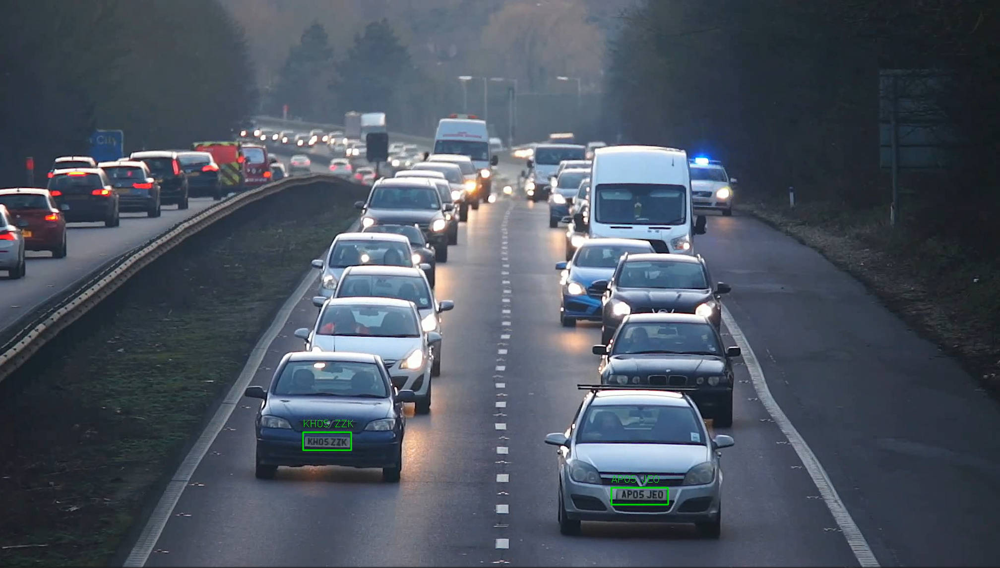

# YOLOv5s 被盗车辆识别系统

[English](readme.md)  /  中文

↑ Click to switch language

本项目通过预训练好的 YOLOv5s 模型对车牌数据集进行训练 使用 EasyOCR 进行车牌提取 并通过处理使其符合英国车牌的格式 然后和 “ 数据库 ” 里的被盗车辆的车牌进行比对 从而识别出被盗车辆是否出现

以下为演示视频 (out_demo) 中的截图



因为传入的只是一个 20 秒的视频进行演示 所以代码中直接定义了 “ 被盗车辆 ” 的列表 如果想进行实时监测的话 可以通过 Tkinter 进行实时数据的更新

在视频处理完成后 可以得到以下的结果 包括可能出现的被盗车辆及其出现的时间

| 疑似被盗车辆      | 时间                  |
|-------------|---------------------|
| GX15 OGJ    | 2024-08-05 21:25:15 |
| AP05 JEO    | 2024-08-05 21:25:21 |

## 目录

- [多语言注释](#多语言注释)
- [数据集](#数据集)
- [文件结构](#文件结构)
- [贡献](#贡献)

## 多语言注释

为了让不同语言背景的开发者更容易理解代码 本项目的注释提供了英文和中文两种版本

## 数据集

本项目使用的车牌数据集来源于 [Kaggle](https://www.kaggle.com/datasets/andrewmvd/car-plate-detection)

因为车牌数据集比较大 所以请自行下载

YOLOv5 模型来源于 [Github](https://github.com/ultralytics/yolov5)

演示视频来源于 [Pexels](https://www.pexels.com/video/traffic-flow-in-the-highway-2103099/)

请直接从提供的链接下载数据集

## 文件结构

项目的文件结构如下

```c++
Stolen_Vehicle_Detection 
│
├── annotations/
│   └── *.xml
│
├── images/
│   └── *.png
│
├── label/
│   └── *.txt
│
├── utils(en/zh)/
│   ├── yolov5
│   ├── __init__.py
│   ├── data_process.py
│   ├── test.py
│   ├── train.ipynb
│   └── yolov5s.pt
│
└── main.py 
```

## 贡献

欢迎所有形式的贡献！无论是报告错误还是提出建议 非常感谢！！